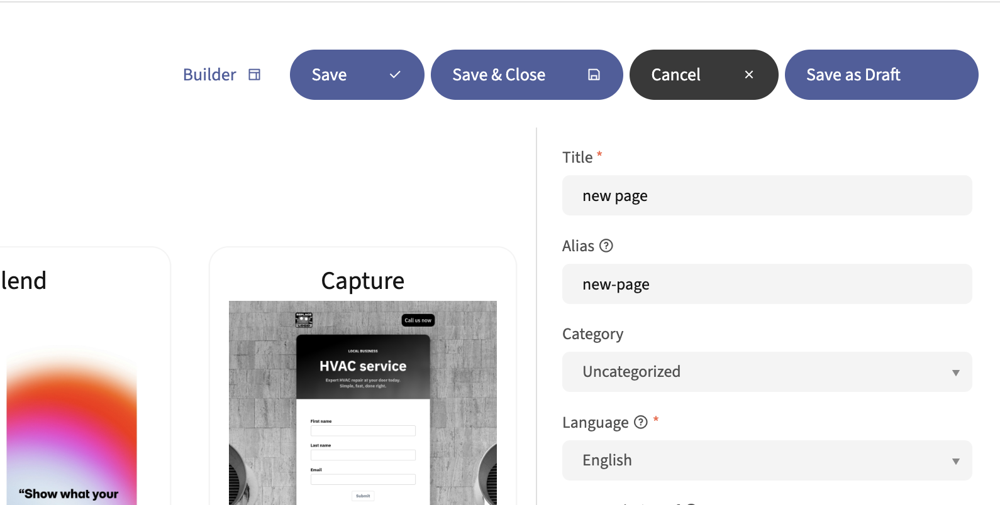
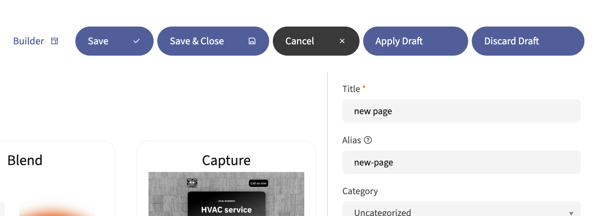
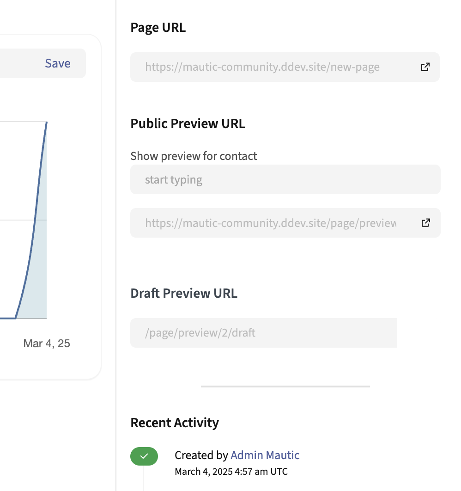

Landing Pages
#############

.. vale off

Customizing the Preference Center
*********************************

.. vale on

.. vale off

Landing Page drafts
*******************

Creating a draft Landing Page
=============================

.. vale on

Mautic allows the creation of Landing Page Drafts using the 'Save as Draft' button in the Landing Page editor.

This feature needs turning on by adding the configuration parameter ``page_draft_enabled`` to your ``local.php`` configuration file as detailed below.

.. code:: php

  'page_draft_enabled' => 1

Once turned on, the 'Save as Draft' button appears on the Landing Page edit interface.

Only one Draft at a time can exist for any given Landing Page. When working with a Draft, the 'Save as Draft' button instead displays two buttons, 'Apply Draft' and 'Discard Draft'.

You can only change the content of the Landing Page itself when it's in Draft. Changes to the Subject, Internal Name, selected Segment, etc. apply to the original Landing Page even when editing a Draft version of it. The Draft content exists separately from the original Landing Page.

.. vale off

Previewing a Draft Landing Page
===============================

.. vale on

You can preview a Landing Page Draft may by appending ``/draft`` to the end of the Landing Page preview URL. If an Landing Page has a Draft version, a Draft Preview URL is present on the Landing Page details overview, below the regular Preview URL.

